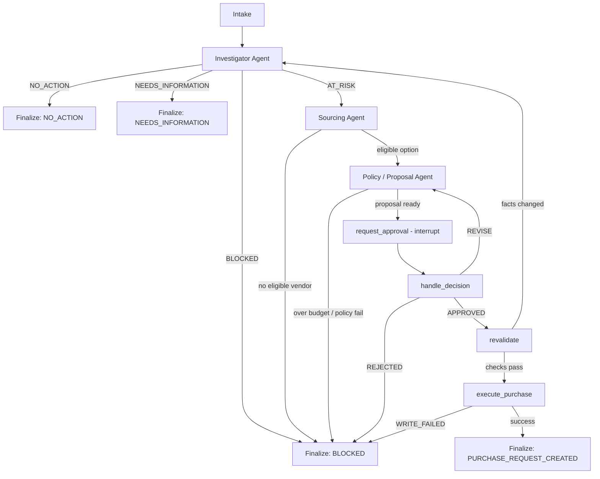

# Inventra Case Flow

## System summary
Three narrow-scope LLM agents hand one stockout case through a LangGraph state machine. A human approves once. Database writes happen in deterministic code outside the agents.

## End-to-end graph


**Write invariant:** only a human `APPROVED` decision followed by passing revalidation can reach a write.

## Trust, but verify
```text
raw tool evidence
    -> LLM proposed status (discarded)
    -> LLM reason prose (kept)
    -> deterministic derive_* function
    -> authoritative status in typed output
```
This pattern is stated for Investigator and repeated for Sourcing and Policy/Proposal.

## Pause and resume
```text
Policy/Proposal
  -> request_approval
  -> interrupt() + checkpoint
  -> process may restart / time may pass
Human: APPROVED | REJECTED | REVISE
Resume: Command(resume=decision)
thread_id = case_id
  -> handle_decision
```

## Agents at a glance

### Investigator
Tools: `get_product`, `get_stock_position`, `get_sales_velocity`, `calculate_stock_risk`.

### Sourcing
Tools shown: `list_vendor_offers`, `get_vendor_performance`, `build_vendor_options`, `recommend_vendor_option`.

### Policy / Proposal
Tools shown: `get_budget_position`, `get_policy_guidance`, `draft_replenishment_proposal`.

> **Snapshot note:** this older overview labels Sourcing and Policy/Proposal as `PLANNED`. Later supplied interface files label both `Built & tested`.

## Scenario coverage visible in this PDF
| # | Scenario | Outcome | Mechanism |
|---|---|---|---|
| 1 | Healthy stock | `NO_ACTION` | Investigator ends before Sourcing |
| 2 | Missing request data | `NEEDS_INFORMATION` | `validate_input()` before tool calls |
| 3 | Stale inventory snapshot | `BLOCKED` | `derive_status()` checks stale risk |
| 4 | Cost vs speed trade-off | `AWAITING_APPROVAL` | Sourcing explains deterministic recommendation trade-off |
| 5 | Over-budget proposal | `BLOCKED` | Policy compares cost to `budget.remaining` in code |
| 6 | Invalid model output | `BLOCKED` | one repair then fail closed; this snapshot says not yet implemented |
| 7 | Approval data changes | reroute / block | revalidation fails and routes to Investigator |
| 8 | Duplicate approval resume | created once | deterministic idempotency key + DB unique constraint |
| 9 | Human rejection | `BLOCKED` | audited rejection; no write |
| 10 | Database write failure | `BLOCKED` | `WRITE_FAILED`; no partial success |
| 11 | Insufficient sales history | `NEEDS_INFORMATION` | `INSUFFICIENT_DATA` short-circuits risk calculation |

> The source says there are 12 acceptance scenarios, but the exported PDF does not visibly include a complete twelfth row.
