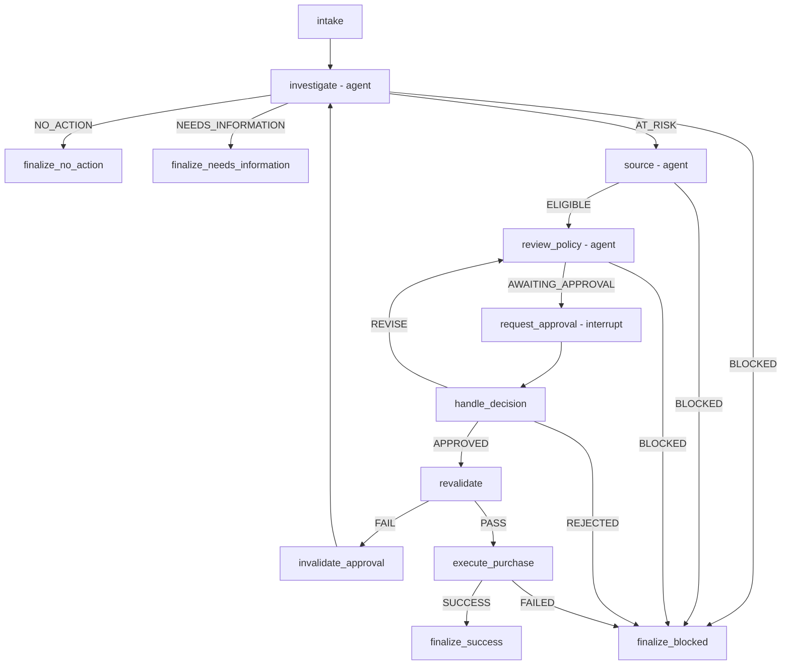

# Inventra Case Graph

## What this establishes
The case graph itself contains **zero LLM call sites**.

- 13 registered nodes.
- 3 nodes invoke an agent: `investigate`, `source`, `review_policy`.
- 10 nodes are plain deterministic functions.
- `execute_purchase` is the only graph node that calls `create_purchase_request`.
- `create_purchase_request` is not in any agent's tool list.
- Human approval is a plain-function `interrupt()`, not a fourth agent.

## Full call chain
1. `intake()` - `graph.py:56`
2. `investigate()` - `graph.py:69` - invokes Investigator
3. `source()` - `graph.py:84` - only on `AT_RISK`
4. `review_policy()` - `graph.py:101` - only on `ELIGIBLE`; re-entry for `REVISE`
5. `request_approval()` - `graph.py:120` - `prepare_approval_request()` + `interrupt()`
6. `handle_decision()` - `graph.py:133` - records and audits human decision
7. `revalidate()` - `graph.py:160` - only after `APPROVED`
7b. `invalidate_approval()` - `graph.py:174` - on failed revalidation; clears stale outputs and loops to Investigator
8. `execute_purchase()` - `graph.py:192` - `create_purchase_request()` with deterministic `idempotency_key`
9. Finalizers - `graph.py:243-258`

## Graph as built


## Write safety
Three gates precede the purchase write:
1. named human approval,
2. passing revalidation,
3. deterministic idempotency / duplicate protection.

## Proven outcomes listed in the source
| Area | Behavior |
|---|---|
| Healthy stock | `NO_ACTION` before Sourcing |
| Stale data | blocks before Sourcing |
| No eligible vendor | blocks before proposal |
| Full success | pauses, resumes, revalidates, writes exactly once |
| Duplicate approval | one purchase row |
| Revalidation failure | approval invalidated; loops back through agent chain |
| Human rejection | blocks; no write |

## CaseState fields visible in the source
`CaseState` is `TypedDict(total=False)`.

```text
case_id
trace_id
sku
warehouse_id
target_cover_days
budget_month
strategy
investigator_output
sourcing_output
proposal_output
approval_request
approval_decision
decision_route
revision_count
revalidation
purchase_result
final_status
final_reason
audit_event_ids
```

> **Source limitation:** page 6 contains a note whose body is clipped in the original export. It starts by saying the provided `revalidate_approved_proposal()` in `tools/execution.py` is a stub. The supplied Technical Review states that real revalidation was subsequently implemented.
