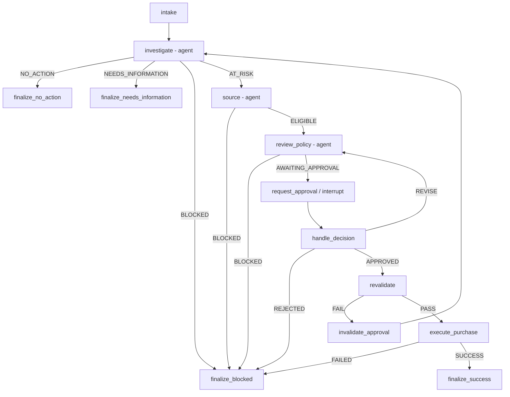

# Inventra - Compact Agent Context

## Mission

Inventra is a LangGraph-based multi-agent stockout-resolution system for one SKU at one warehouse. It investigates stockout risk, sources a vendor, prepares/reviews a replenishment proposal, pauses for named human approval, revalidates facts, and creates at most one purchase request.

## Non-negotiable safety invariants

1. An LLM agent may read evidence and narrate reasoning, but **authoritative business status and arithmetic come from deterministic code/tools**.
2. No LLM agent can call `create_purchase_request`.
3. The system may reject/block automatically, but **cannot approve a purchase automatically**.
4. Approval belongs to an exact proposal version/hash.
5. After approval, stock/offer/budget/proposal facts must be revalidated.
6. A changed fact invalidates stale approval.
7. The purchase write is idempotent and protected by a unique database constraint.
8. Critical handoffs use typed/Pydantic objects, not parsing of free-form prose.
9. Maximum model attempts per agent node: two (initial + one repair) according to the requirements brief.
10. Audit records should store structured summaries/evidence, not private chain-of-thought.

## Core business rules

| Rule | Requirement |
|---|---|
| Inventory freshness | snapshot no more than 2 hours old; older -> `DATA_STALE` |
| Available units | `on_hand - reserved + confirmed_inbound` |
| Demand | use provided 7-day and 30-day sales metrics; do not invent sales |
| Target cover | default 14 days; allowed 7-45 days |
| Vendor reliability | at least `0.90` |
| Offer validity | active and currently valid |
| Timing | normal recommendation must arrive before projected stockout |
| Budget | proposed total cost must fit latest remaining monthly budget for normal progression |
| Approval | named human approves exact proposal version/hash |
| Revalidation | recheck inventory, offer validity, proposal hash, and budget immediately before write |
| Duplicate safety | deterministic idempotency key + unique DB constraint |

## Agent boundaries

### Investigator
Objective: decide whether action is required.

Input:
- `case_id`
- `sku`
- `warehouse_id`
- `target_cover_days`

Tools:
- `get_product`
- `get_stock_position`
- `get_sales_velocity`
- `calculate_stock_risk`

Authoritative exit states:
- `NO_ACTION`
- `NEEDS_INFORMATION`
- `BLOCKED`
- `AT_RISK`

Only `AT_RISK` continues.

Critical handoff:
- `risk: StockRisk` passes directly to Sourcing.

### Sourcing
Objective: choose a grounded eligible vendor option for an at-risk case.

Input:
- case identifiers
- `risk: StockRisk`
- strategy (default shown as `"balanced"`)

Tools:
- `list_vendor_offers`
- `get_vendor_performance`
- `build_vendor_options`
- `recommend_vendor_option`

Authoritative exit states:
- `BLOCKED`
- `ELIGIBLE`

Eligibility uses deterministic vendor evidence; reliability threshold is at least `0.90`.

Critical handoff:
- `recommendation: VendorRecommendation` / chosen typed `VendorOption` goes directly to proposal drafting.

### Policy / Proposal
Objective: use policy guidance + budget evidence to draft a hash-locked proposal and decide whether it can be shown for approval.

Inputs:
- case identifiers
- Investigator `stock`, `sales`, `risk`
- Sourcing `recommendation`
- `budget_month`

Tools:
- `get_budget_position`
- `get_policy_guidance`
- `draft_replenishment_proposal`

Authoritative exit states:
- `BLOCKED`
- `AWAITING_APPROVAL`

Budget gate:
- `derive_policy_result()` compares real proposal cost to real remaining budget.
- LLM budget judgment is not authoritative.

Critical handoff:
- exact hash-locked proposal -> deterministic `request_approval`.

## Deterministic graph

## Human approval semantics

- `request_approval()` is deterministic.
- `interrupt()` checkpoints the graph under `case_id` / thread identity.
- The graph can resume later, including after process restart.
- Permitted decisions shown in the supplied architecture: `APPROVED`, `REJECTED`, `REVISE`.
- `REVISE` returns to policy/proposal with bounded revision required by the challenge.
- `APPROVED` is not sufficient by itself; revalidation must pass.

## Write boundary

`execute_purchase()` is deterministic and calls `create_purchase_request()` with an idempotency key. `create_purchase_request` is not exposed as an LLM tool.

## High-level outcomes

Terminal business outcomes used across the implementation material:
- `NO_ACTION`
- `NEEDS_INFORMATION`
- `BLOCKED`
- `PURCHASE_REQUEST_CREATED`

Important non-terminal/pause status:
- `AWAITING_APPROVAL`

Agent-internal routing statuses:
- Investigator: `AT_RISK`
- Sourcing: `ELIGIBLE`

## Source-awareness rules for another agent

- For challenge requirements, prefer `07_inventra_student_design_challenge.md`.
- For supplied implementation status, prefer `08_inventra_technical_review.md` and `06_inventra_case_graph.md`.
- Dedicated agent-interface files are the best source for per-agent inputs, outputs, call chains, and handoffs.
- `05_inventra_case_flow.md` is useful for architecture but contains older `PLANNED` labels.
- Do not invent text missing from clipped PDF table columns.
